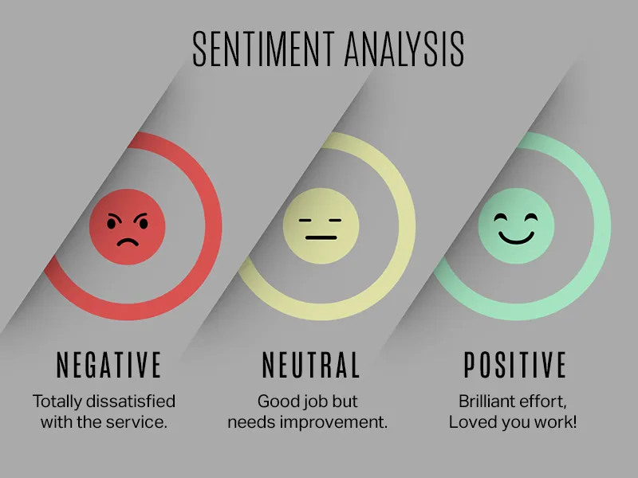

# Twitter Sentiment Analysis

**Author:** Kristina Zakaryan

---

## Project Overview

This project performs sentiment analysis on Twitter data, classifying tweets into positive, negative, or neutral sentiment. The main goal is to preprocess the data, train models, and interpret their results to understand how well sentiment can be predicted from text.

---

## Steps Taken

1. **Data Preprocessing**
    - Tokenization
    - Stop-words Removal
    - Stemming / Lemmatization
    - TF-IDF Vectorization

2. **Model Training**
    - Multinomial Naive Bayes
    - Logistic Regression (with cross-validation)

3. **Model Evaluation**
    - Accuracy and F1-score calculation
    - Confusion matrix visualization
    - Analysis of results and identification of possible improvements

---

## Results

**Model Performance Summary:**

| Model                     | Accuracy |
|----------------------------|----------|
| Multinomial Naive Bayes    | 77%      |
| Logistic Regression (CV)   | 75%      |

